# 软件功能规格说明
项目：程序设计实训 2023 大作业:交互式医学数 据分析平台
| 更新日期 | 作者 | 版本 | 备注 |
| -------- | -------- | -------- | -------- |
| 9/9/2023 | 苏伟铭 | 1.0 | 初始版本 |
- [软件功能规格说明](#软件功能规格说明)
  - [1. 业务概览](#1-业务概览)
    - [1.1 概览](#11-概览)
    - [1.2 相关文档](#12-相关文档)
    - [1.3 假设](#13-假设)
    - [1.4 问题/澄清记录](#14-问题澄清记录)
  - [2. 功能需求](#2-功能需求)
    - [2.1 流程概述](#21-流程概述)
      - [2.1.1 上传界面](#211-上传界面)
      - [2.1.2 Raw Data View](#212-raw-data-view)
      - [2.1.3 直方图界面](#213-直方图界面)
      - [2.1.4 散点图与曲线拟合界面](#214-散点图与曲线拟合界面)
      - [2.1.5 相关性与协方差矩阵界面](#215-相关性与协方差矩阵界面)
      - [2.1.6 PCA降维绘制界面](#216-pca降维绘制界面)
      - [2.1.7 聚类分析界面](#217-聚类分析界面)
      - [2.1.8 机器学习归因分析界面](#218-机器学习归因分析界面)
    - [2.2 程序编译指南](#22-程序编译指南)
      - [2.2.1 使用CMake](#221-使用cmake)
      - [2.2.1 使用MXE交叉编译](#221-使用mxe交叉编译)
    - [2.3 可拓展性与未来增强](#23-可拓展性与未来增强)
    - [2.4 用户界面：UI布局](#24-用户界面ui布局)
      - [2.4.1 上传界面](#241-上传界面)
      - [2.4.2 Raw Data View](#242-raw-data-view)
      - [2.4.3 直方图界面](#243-直方图界面)
      - [2.4.4 散点图与曲线拟合界面](#244-散点图与曲线拟合界面)
      - [2.4.5 相关性与协方差矩阵界面](#245-相关性与协方差矩阵界面)
      - [2.4.6 PCA降维绘制界面](#246-pca降维绘制界面)
      - [2.4.7 聚类分析界面](#247-聚类分析界面)
      - [2.4.8 机器学习归因分析界面](#248-机器学习归因分析界面)
    - [2.5 用户界面：UI输入与验证](#25-用户界面ui输入与验证)
      - [2.5.1 上传界面](#251-上传界面)
      - [2.5.2 Raw Data View](#252-raw-data-view)
      - [2.5.3 直方图界面](#253-直方图界面)
      - [2.5.4 散点图与曲线拟合界面](#254-散点图与曲线拟合界面)
      - [2.5.5 相关性与协方差矩阵界面](#255-相关性与协方差矩阵界面)
      - [2.5.6 PCA降维绘制界面](#256-pca降维绘制界面)
      - [2.5.7 聚类分析界面](#257-聚类分析界面)
      - [2.5.8 机器学习归因分析界面](#258-机器学习归因分析界面)
  - [3. 依赖、设计约束和其他考虑因素](#3-依赖设计约束和其他考虑因素)
    - [3.1 设计思路](#31-设计思路)
    - [3.2 状态管理](#32-状态管理)
  - [4. 异常情况](#4-异常情况)
    - [4.1 已知异常](#41-已知异常)
  - [5. 测试需求](#5-测试需求)
    - [5.1 测试条件](#51-测试条件)
  - [6. 附加信息](#6-附加信息)
    - [6.1 硬件描述](#61-硬件描述)
    - [6.2 术语表](#62-术语表)
  - [7. 附录](#7-附录)

## 1. 业务概览
### 1.1 概览
医学数据分析在现代医疗领域具有重要意义，它能够帮助医生们深入探究患者的病情和健康状况，根据以往患者的数据推断影响病情的因素，从而做出更准确的诊断和治疗方案。

医学数据分析是将现代医学中积累的海量数据与计算机技术相结合的一门关键领域。在这个作业中，我们将关注一个人是否患上某种特定疾病，以及与该疾病相关的各种指标，如生化数据、体征等。通过对这些医学数据的分析，我们可以揭示患病与各种生理指标、生活方式等 因素之间的关系。这种分析有助于确定疾病的发生原因，深入了解潜在的健康风险，并为医生提供更精确的诊断和治疗建议。
### 1.2 相关文档
| 文档名 | 作者 | 内容描述 |
| -------- | -------- | -------- |
| self-evaluation.xlsx | 苏伟铭 | 自评表 |
### 1.3 假设
1. 输入数据是类似所提供的`breast_cancer.csv`，每列数据示例如下

| ID | Diagnosis | Feature 1 | Feature 2 | ... |
| -------- | -------- | -------- | -------- | --- |
| 001 | B | 0.32234 | 0.45455 | ... |
| 002 | M | 0.24555 | 0.43544 | ... |
| 003 | B | 0.64564 | 0.78675 | ... |

1. 此软件只考虑单一数据源。
2. 输入数据已经过数据清洗。

### 1.4 问题/澄清记录
无
## 2. 功能需求
### 2.1 流程概述
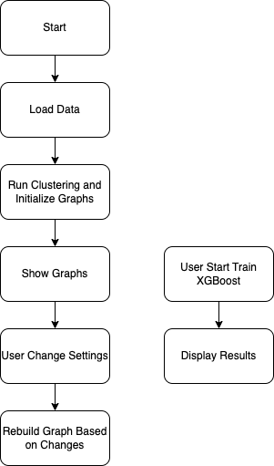

图1：项目流程图
#### 2.1.1 上传界面
根据图1中的流程，用户在本界面进行以下操作：
1. 打开软件。
2. 点击Load CSV Data按键或上方主菜单栏上的File->Load按键选择输入文件。
3. 选择了文件软件会自动加载输入文件。
4. 处理完后系统会跳转至下一个界面（2.1.2），请耐心等待跳转。

| 操作 | 用户 | 系统 | 备注 |
| ------ | ------ | ------ | ------ |
| 打开软件 | 双击 | - | - |
| 加载csv | 单击 | 加载csv并跳转至下一界面 | - |
#### 2.1.2 Raw Data View
根据图1中的流程，用户在本界面进行以下操作：
1. 点击左侧菜单前往其他页面（2.1.2-2.1.8）。
2. 点击上方主菜单File->Load按键选择输入文件重新加载数据。
3. 鼠标水平与垂直滚动查看所加载的数据列表。
4. 点击列头显示该列的均值与方差。

| 操作 | 用户 | 系统 | 备注 |
| ------ | ------ | ------ | ------ |
| 点击左侧菜单元件 | 单击 | 跳转到相应界面（2.1.2-2.1.8） | - |
| 点击File->Load | 单击 | 重新加载所选文件并跳转到2.1.2 | - |
| 滚动查看列表 | 滑动 | 列表根据用户操作水平/垂直滑动 | - |
| 点击列头 | 单击 | 加载该列数据计算出均值方差并在对话窗口显示出来 | - |
#### 2.1.3 直方图界面
根据图1中的流程，用户在本界面进行以下操作：
1. 点击左侧菜单前往其他页面（2.1.2-2.1.8）。
2. 点击上方主菜单File->Load按键选择输入文件重新加载数据。
3. 在Column下拉选项中选择要显示出来的列，下方直方图会自动刷新。
4. 在Show Normal Distribution Curve复选框中选择，直方图上会显示根据该列计算出的均值方差的正态分布曲线。

| 操作 | 用户 | 系统 | 备注 |
| ------ | ------ | ------ | ------ |
| 点击左侧菜单元件 | 单击 | 跳转到相应界面（2.1.2-2.1.8） | - |
| 点击File->Load | 单击 | 重新加载所选文件并跳转到2.1.2 | - |
| 选择列 | 下拉选择 | 根据用户所选列进行处理并生成直方图，自动刷新界面 | - |
| 选择显示正态分布 | 复选框选择 | 根据所选列计算出的均值方差的正态分布曲线，并重叠示在直方图上 | - |
#### 2.1.4 散点图与曲线拟合界面
根据图1中的流程，用户在本界面进行以下操作：
1. 点击左侧菜单前往其他页面（2.1.2-2.1.8）。
2. 点击上方主菜单File->Load按键选择输入文件重新加载数据。
3. 在x-axis下拉选项中选择x轴，下方散点图图会自动刷新。
4. 在y-axis下拉选项中选择y轴，下方散点图图会自动刷新。
5. 在Power数字输入中选择拟合曲线的次方，下方拟合曲线会自动刷新。
6. 点击散点图上的点，右下角会显示该点坐标。

| 操作 | 用户 | 系统 | 备注 |
| ------ | ------ | ------ | ------ |
| 点击左侧菜单元件 | 单击 | 跳转到相应界面（2.1.2-2.1.8） | - |
| 点击File->Load | 单击 | 重新加载所选文件并跳转到2.1.2 | - |
| 选择x轴列 | 下拉选择 | 根据用户所选x轴列进行处理并生成散点图，自动刷新界面 | x轴不能与y轴相同，否则会有错误提示 |
| 选择y轴列 | 下拉选择 | 根据用户所选y轴列进行处理并生成散点图，自动刷新界面 | x轴不能与y轴相同，否则会有错误提示 |
| 输入power次数 | 数字输入 | 根据所输入次方从散点图数据生成拟合曲线，并重叠示在散点图图上 | - |
| 点击点 | 单击 | 右下角显示该点坐标 | - |
#### 2.1.5 相关性与协方差矩阵界面
根据图1中的流程，用户在本界面进行以下操作：
1. 点击左侧菜单前往其他页面（2.1.2-2.1.8）。
2. 点击上方主菜单File->Load按键选择输入文件重新加载数据。
3. 在Type下拉选项中选择要生成相关性矩阵还是协方差矩阵，下方矩阵图会自动刷新。
4. 在Columns下拉选项中选择要处理的列（多选），下方矩阵图会自动刷新。

| 操作 | 用户 | 系统 | 备注 |
| ------ | ------ | ------ | ------ |
| 点击左侧菜单元件 | 单击 | 跳转到相应界面（2.1.2-2.1.8） | - |
| 点击File->Load | 单击 | 重新加载所选文件并跳转到2.1.2 | - |
| 选择Type | 下拉选择 | 根据用户所选生成相关性矩阵/协方差矩阵，自动刷新界面 | - |
| 选择列 | 下拉多选 | 根据所选列计算出相关性矩阵/协方差矩阵，并显示在界面上 | - |
#### 2.1.6 PCA降维绘制界面
根据图1中的流程，用户在本界面进行以下操作：
1. 点击左侧菜单前往其他页面（2.1.2-2.1.8）。
2. 点击上方主菜单File->Load按键选择输入文件重新加载数据。
3. 在Columns下拉选项中选择要处理的列（多选），下方图会自动刷新。
4. 在Dims下拉选项中选择降维输出维数，下方图会自动刷新。

| 操作 | 用户 | 系统 | 备注 |
| ------ | ------ | ------ | ------ |
| 点击左侧菜单元件 | 单击 | 跳转到相应界面（2.1.2-2.1.8） | - |
| 点击File->Load | 单击 | 重新加载所选文件并跳转到2.1.2 | - |
| 选择列 | 下拉多选 | 根据所选列计算出相关性矩阵/协方差矩阵，并显示在界面上 | - |
| 选择Dims | 下拉选择 | 根据用户所选维度生成输出2d/3d散点图，自动刷新界面 | - |
#### 2.1.7 聚类分析界面
根据图1中的流程，用户在本界面进行以下操作：
1. 点击左侧菜单前往其他页面（2.1.2-2.1.8）。
2. 点击上方主菜单File->Load按键选择输入文件重新加载数据。
3. 在Cols下拉选项中选择要处理的列（多选），下方图会自动刷新。
4. 在Algo下拉选项中选择聚类算法，下方图会自动刷新。
5. 在num clusters数字输入中输入聚类输出类别数，下方图会自动刷新。
6. 在Dims下拉选项中选择降维输出维数，下方图会自动刷新。
7. 可点击下方类别复选框对某一类进行隐藏。

| 操作 | 用户 | 系统 | 备注 |
| ------ | ------ | ------ | ------ |
| 点击左侧菜单元件 | 单击 | 跳转到相应界面（2.1.2-2.1.8） | - |
| 点击File->Load | 单击 | 重新加载所选文件并跳转到2.1.2 | - |
| 选择列 | 下拉多选 | 根据所选列进行聚类且更新2.1.2的列表最后4列，并显示在界面上 | - |
| 选择算法 | 下拉选择 | 根据用户所选算法对所选列为输入进行聚类且更新2.1.2的列表最后4列，自动刷新界面 | - |
| 输入num clusters | 数字输入 | 根据所输入聚类类数进行聚类并且更新2.1.2的列表最后4列，自动刷新界面 | 不是所有算法都用到此输入 |
| 选择Dims | 下拉选择 | 根据用户所选维度生成输出2d/3d散点图，自动刷新界面 | - |
| 隐藏/显示类 | 复选框选择 | 根据用户所选在所生成的散点图中隐藏/显示该类，自动刷新界面 | - |
#### 2.1.8 机器学习归因分析界面
根据图1中的流程，用户在本界面进行以下操作：
1. 点击左侧菜单前往其他页面（2.1.2-2.1.8）。
2. 点击上方主菜单File->Load按键选择输入文件重新加载数据。
3. 在Train/Test Split下拉选项中选择训练与测试集比例。
4. 在epochs数字输入中输入训练迭代次数。
5. 在depth数字输入中输入树的最大深度。
6. 点击Start Training开始训练，下方进度条会根据训练进度实时更新，训练完后结果会在下方显示。
   1. ACC显示训练精度
   2. AUC显示AUC指标
   3. F1 score显示模型在测试集预测的F1Score
   4. 图表显示各个特征贡献度，逆序排列
7. 点击Scroll Up/Scroll Down可看上下滚动图表

| 操作 | 用户 | 系统 | 备注 |
| ------ | ------ | ------ | ------ |
| 点击左侧菜单元件 | 单击 | 跳转到相应界面（2.1.2-2.1.8） | - |
| 点击File->Load | 单击 | 重新加载所选文件并跳转到2.1.2 | - |
| 选择Train/Test Split | 下拉选择 | 根据用户所选比例划分训练与测试集 | - |
| 输入epochs | 数字输入 | 根据输入更改训练迭代次数 | - |
| 输入depth | 数字输入 | 根据输入更改树的最大深度 | - |
| 开始训练 | 单击 | 根据用户设置训练迭代模型 | - |
| Scroll Up/Scroll Down | 单击 | 上下滚动图表 | - |
### 2.2 程序编译指南
此项目使用C++语言编写，用到的库有QT和XGBoost
#### 2.2.1 使用CMake
In project root directory,
```mkdir build && cd build```
Validate `CMakeLists.txt`, you might need to set some `CMAKE_PREFIX_PATH` according to your environment setup.
```cmake ..```
```make -j12```
Executables can be found in the `build` directory.

#### 2.2.1 使用MXE交叉编译
Refer to `Dockerfile` provided for instructions.

MXE requires custom build in order to be able to build `xgboost` and `qtdatavis3d`, details can be seen in my fork [https://github.com/wms2537/mxe.git](https://github.com/wms2537/mxe.git).

### 2.3 可拓展性与未来增强
目前此项目只是一个非常简单的可视化平台，没有任何其他功能。它可以成为一个模块嵌入其他系统，或者成为一个工具。但是最终也是要看目标用户的真正需求。

现实中的数据源可能来自很多不同的地方，不同的部门，不同的机器等等。要怎么去整合这些数据需要一个很强的针对医院的数字化解决方案。因此才说这个项目是一个大项目里面的其中一个模块罢了。而且这里处理的任务非常单一，若需要处理更加复杂多变的数据和进行更精准的预测则需要更好的机器学习或深度学习模型。我所知道市场上比较成熟的针对医疗行业的机器学习框架有Nvidia的Clara Holoscan。

现在很多成熟开源的数据可视化框架比如apache superset，grafana，redash等等的也能够让用户可以很容易的去客制化属于他们自己的仪表板。此项目距离这些平台还有很大的距离。
### 2.4 用户界面：UI布局
#### 2.4.1 上传界面
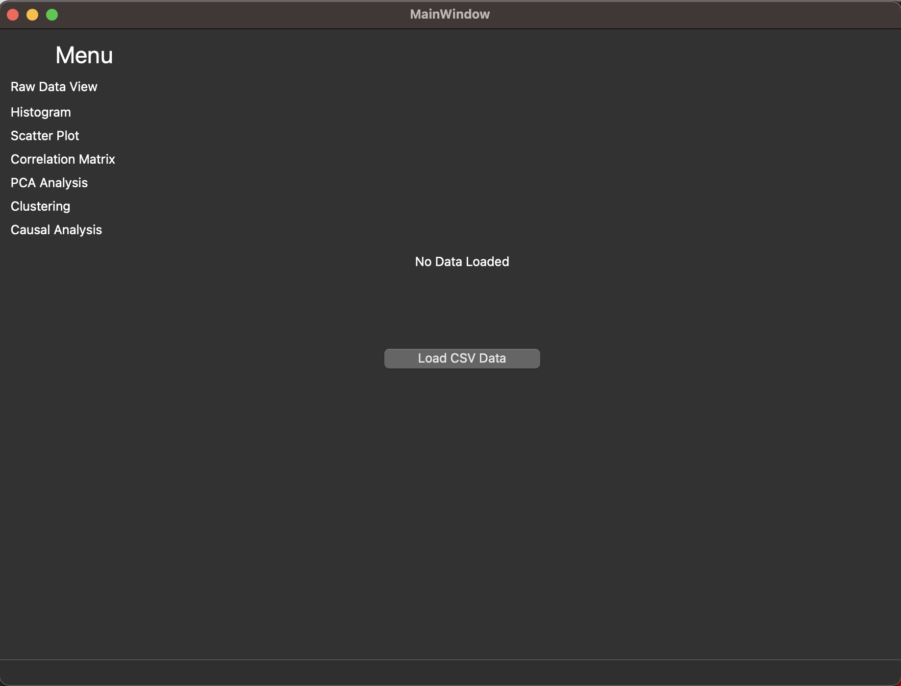

#### 2.4.2 Raw Data View
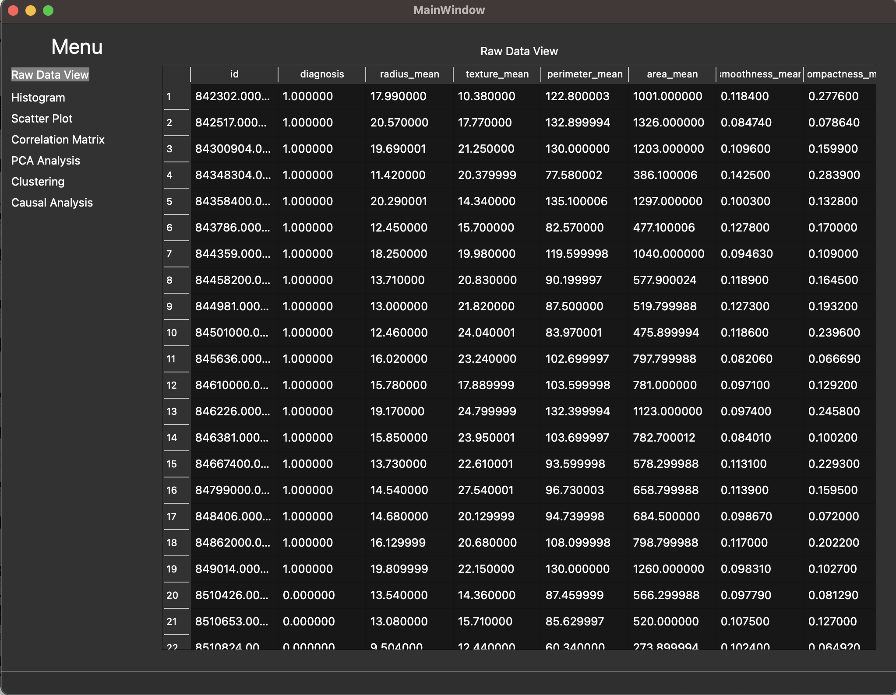

#### 2.4.3 直方图界面
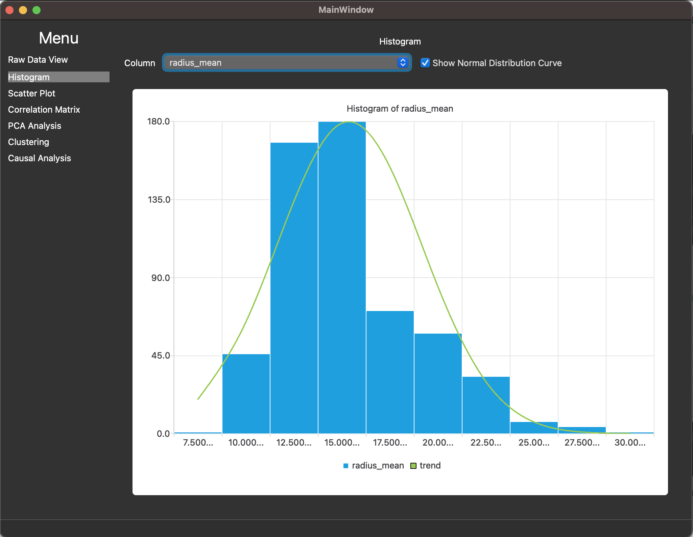

#### 2.4.4 散点图与曲线拟合界面
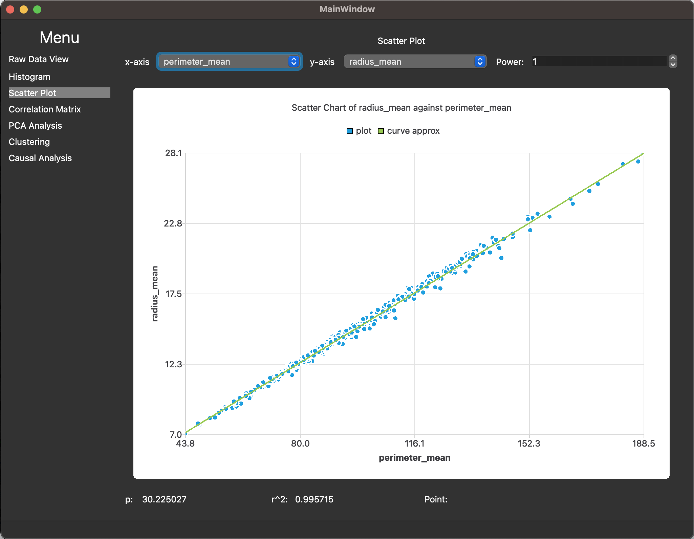

#### 2.4.5 相关性与协方差矩阵界面
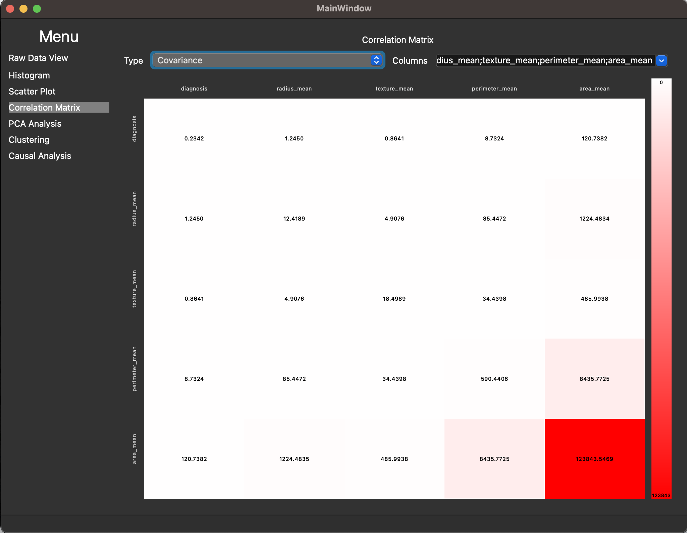

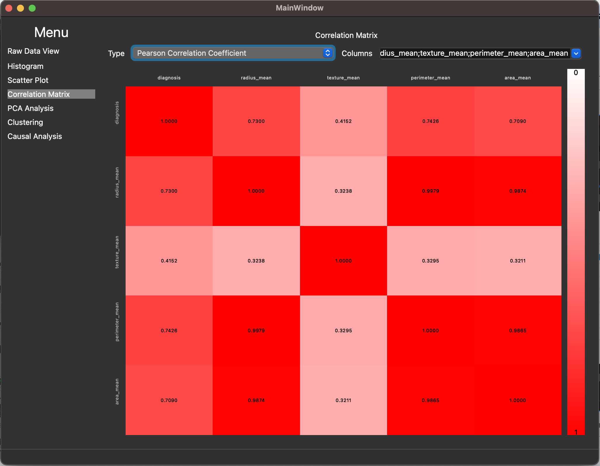
#### 2.4.6 PCA降维绘制界面
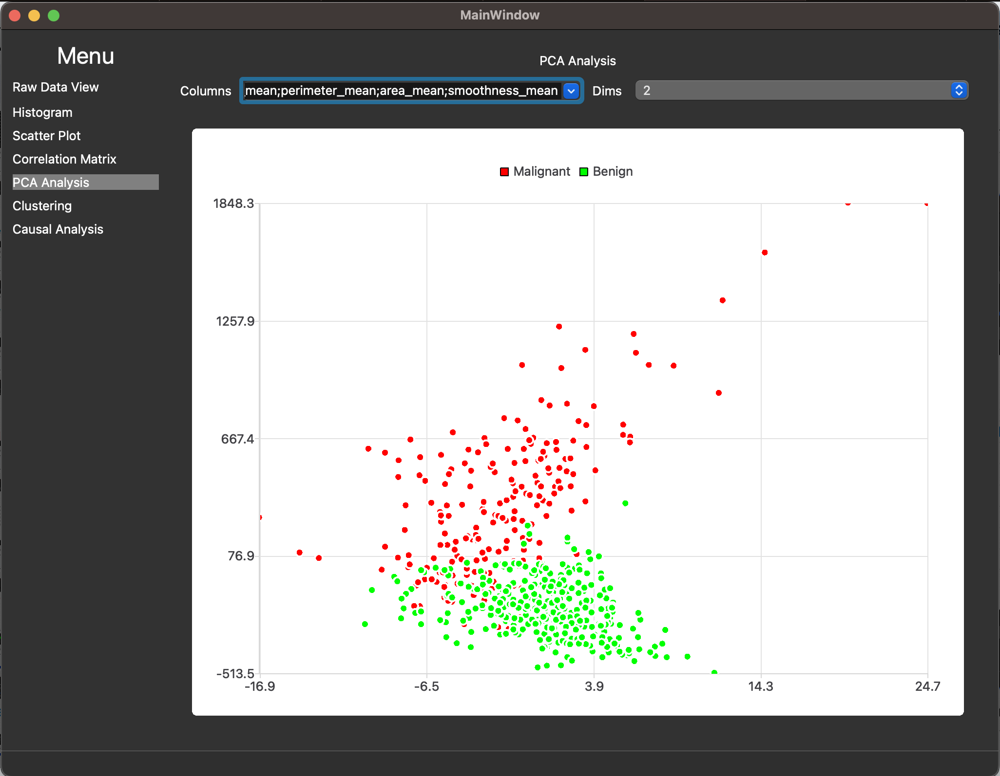

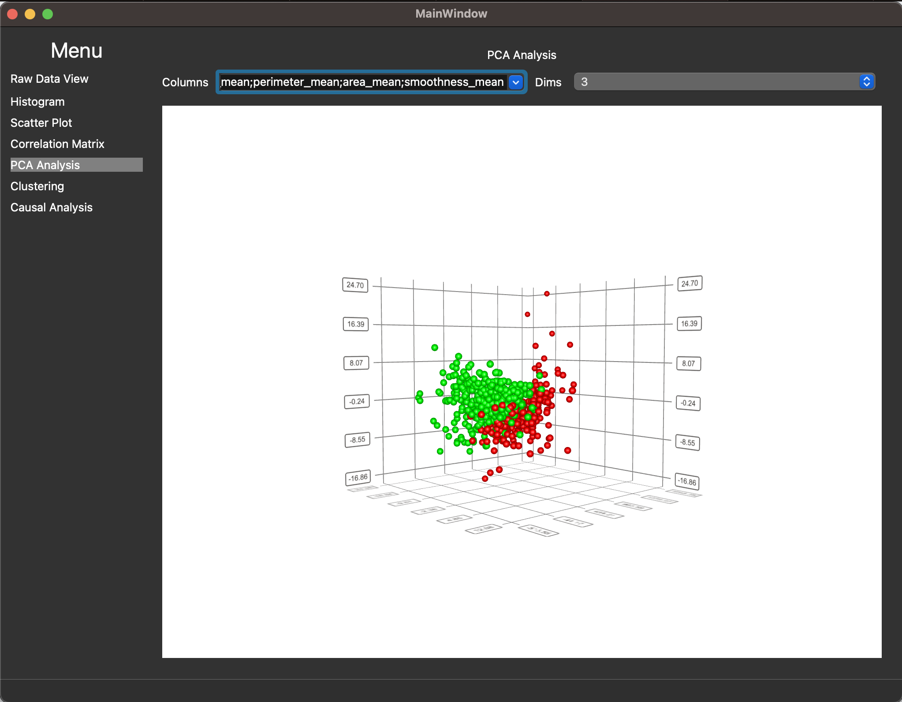

#### 2.4.7 聚类分析界面
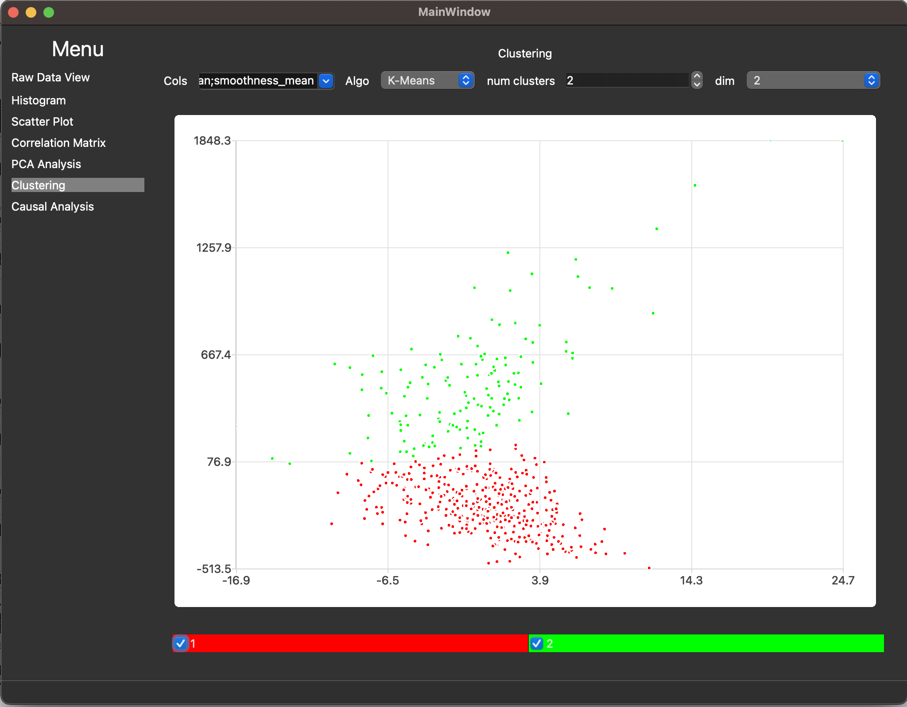

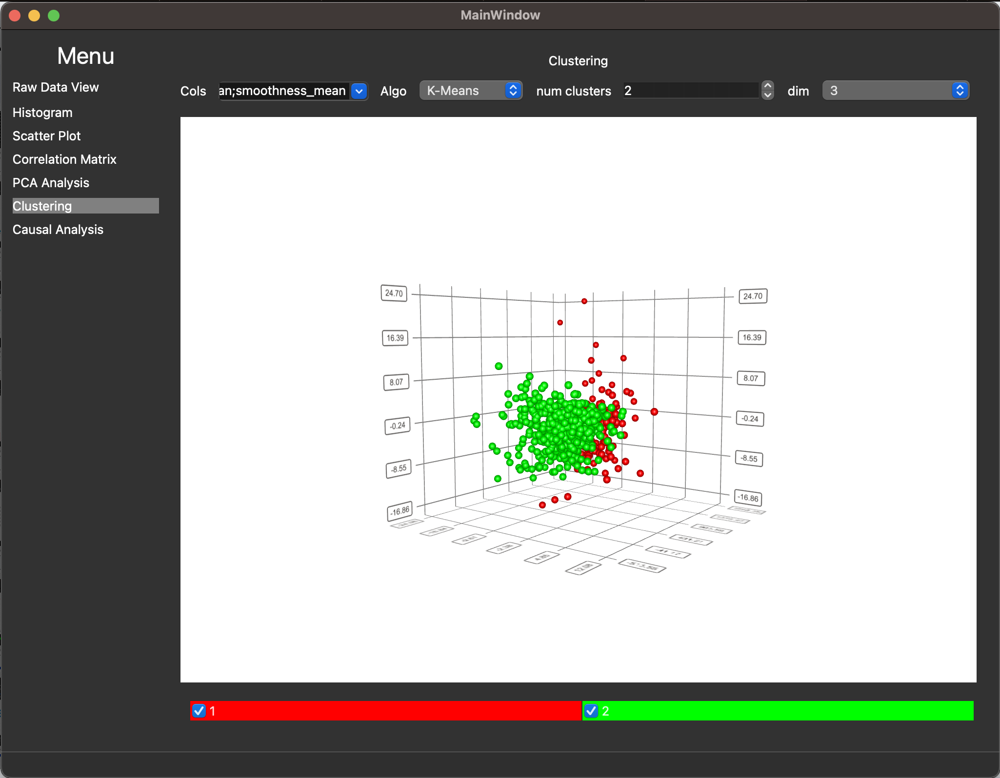

#### 2.4.8 机器学习归因分析界面
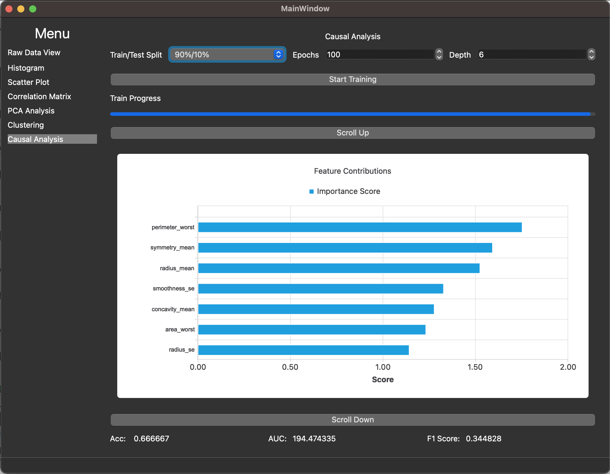

### 2.5 用户界面：UI输入与验证
#### 2.5.1 上传界面
csv的格式参考[1.3 假设](#13-假设)里的。
#### 2.5.2 Raw Data View
无
#### 2.5.3 直方图界面
| 输入字段 | 类型 | 属性 | 参数 | 默认值 | 描述 | 验证 |
| ------ | ------ | ------ | ------ | ------ | ------ | ------ |
| Column | string | mandatory | dropdown select | diagnosis | 选择列 | - |
| Show Normal Distribution Curve | boolean | - | checkbox | false | 选择显示正态分布 | - |

#### 2.5.4 散点图与曲线拟合界面
| 输入字段 | 类型 | 属性 | 参数 | 默认值 | 描述 | 验证 |
| ------ | ------ | ------ | ------ | ------ | ------ | ------ |
| x-axis | string | mandatory | dropdown select | diagnosis | 选择x轴列 | - |
| y-axis | string | mandatory | dropdown select | radius_mean | 选择y轴列 | - |
| Power | number | - | spinbox | 1 | 输入power次数 | number |
#### 2.5.5 相关性与协方差矩阵界面
| 输入字段 | 类型 | 属性 | 参数 | 默认值 | 描述 | 验证 |
| ------ | ------ | ------ | ------ | ------ | ------ | ------ |
| type | string | mandatory | dropdown select | Covariance | 选择相关性矩阵/协方差矩阵 | - |
| Columns | string[] | mandatory | dropdown multiselect | diagnosis;radius_mean;texture_mean; perimeter_mean;area_mean | 选择列 | - |
#### 2.5.6 PCA降维绘制界面
| 输入字段 | 类型 | 属性 | 参数 | 默认值 | 描述 | 验证 |
| ------ | ------ | ------ | ------ | ------ | ------ | ------ |
| Columns | string[] | mandatory | dropdown multiselect | radius_mean;texture_mean; perimeter_mean;area_mean | 选择列 | - |
| Dims | number | mandatory | dropdown select | 2 | 选择输出维度 | - |
#### 2.5.7 聚类分析界面
| 输入字段 | 类型 | 属性 | 参数 | 默认值 | 描述 | 验证 |
| ------ | ------ | ------ | ------ | ------ | ------ | ------ |
| Cols | string[] | mandatory | dropdown multiselect | radius_mean;texture_mean; perimeter_mean;area_mean | 选择列 | - |
| Algo | string | mandatory | dropdown select | 2 | 选择算法 | - |
| num clusters | number | mandatory | spinbox | 2 | 输入聚类类数 | number |
| Dims | number | mandatory | dropdown select | 2 | 选择输出维度 | - |
#### 2.5.8 机器学习归因分析界面
| 输入字段 | 类型 | 属性 | 参数 | 默认值 | 描述 | 验证 |
| ------ | ------ | ------ | ------ | ------ | ------ | ------ |
| Train/test Split | string | mandatory | dropdown select | 90%/10% | 选择算法 | - |
| epochs | number | mandatory | spinbox | 100 | 输入训练迭代次数 | number |
| depth | number | mandatory | spinbox | 6 | 输入训练迭代次数 | number |

## 3. 依赖、设计约束和其他考虑因素
### 3.1 设计思路
所有功能直接在mainwindow上完成，由于所有功能都属于同一个类别，且项目复杂度较低，没有分开不同窗口的必要，而且太多窗口会增加操作难度和状态管理难度。

项目使用以下layout

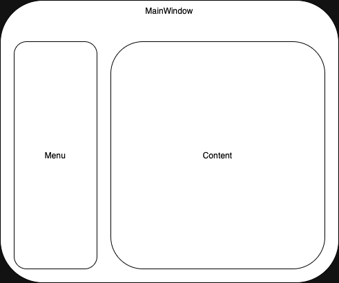

### 3.2 状态管理
项目采用类似flutter中provider的状态管理思路，即有一个service作为中央数据管理与处理服务。每个界面都连接到该service获取数据或调用函数。

## 4. 异常情况
### 4.1 已知异常
无

## 5. 测试需求
### 5.1 测试条件
此项目未编写单元测试，综合测试和e2e测试。

## 6. 附加信息
无
### 6.1 硬件描述
无
### 6.2 术语表
无

## 7. 附录
1. QT [https://www.qt.io](https://www.qt.io)
2. XGBoost [https://xgboost.readthedocs.io/en/stable/](https://xgboost.readthedocs.io/en/stable/)
3. MXE [https://mxe.cc](https://mxe.cc)